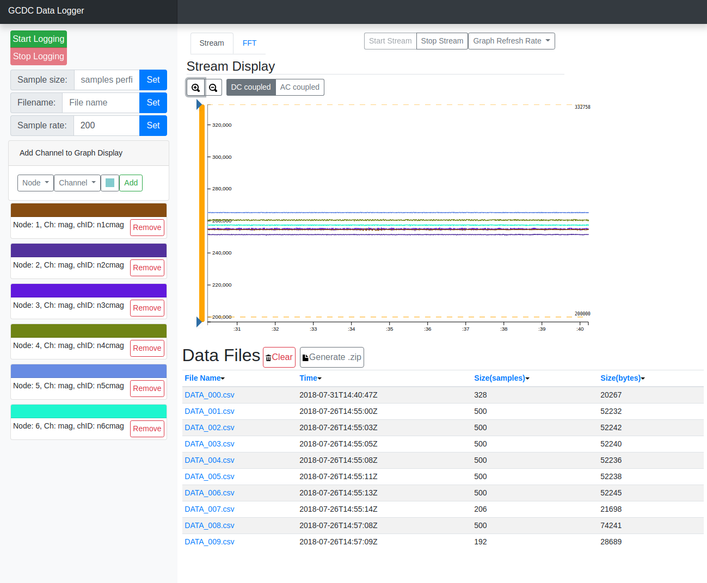

# frontend-jco-datalogger
This repo contains a dashboard style web interface for the [jco-datalogger](https://github.com/Awalrod/jco-datalogger) 
utility. 

## Javascript
### Getting Data
```
	var address = document.location.host;
	var streamSocket = new WebSocket("ws://"+address+":7333");
	streamSocket.onopen = function(event){
		var nodeid = 1; // can also be 'all'
		streamSocket.send('nodeid='+nodeid);
		streamSocket.send('stream=true');
	}
	streamSocket.onmessage = function(event){
		var data = JSON.parse(event.data);
		// if nodeid = <int>:
		// data = {x:<int>, y:<int>, z:<int>}
		// if nodeid = 'all'
		// data = [{x:<int>, y:<int>, z:<int>},{x:<int>, y:<int>,z:<int>},...]
		// 
		// note that nodeied is the index in this list ^^, not the
		// actual canopen nodied
		// There will be an entry in the list for each node entry in
		// loggerconfig.xml
	}
```  

### Controlling the Logger
```
	var address = document.location.host;
	var controllerSocket = new WebSocket("ws://"+address+":7331");
	
	//Change the sample rate
	var sampleRate = 200; // logger can do 200Hz max
	controllerSocket.send('sampleRate='+sampleRate)
```
For more controls and commands see the readme for
[jco-datalogger](https://github.com/Awalrod/jco-datalogger)